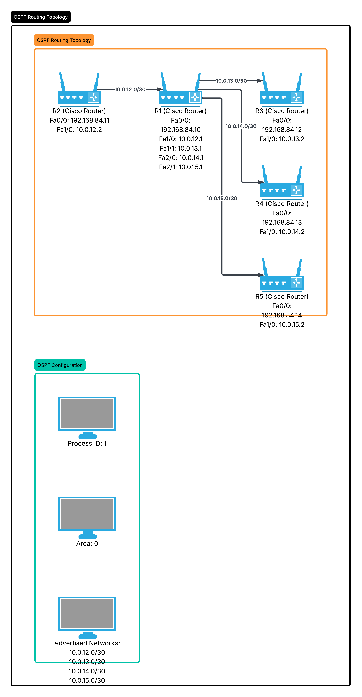
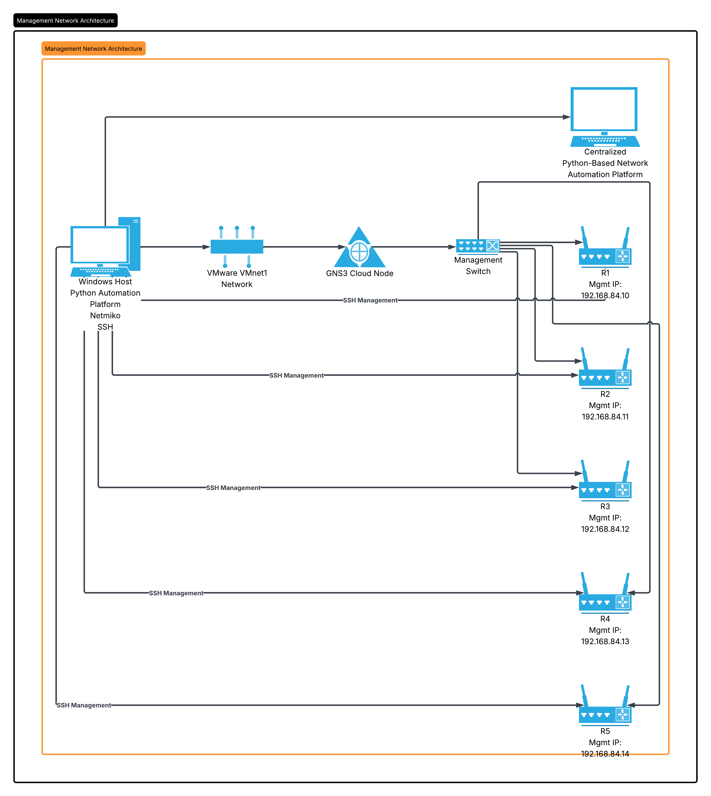
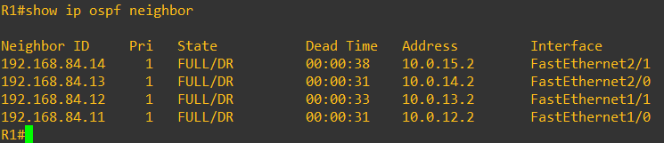
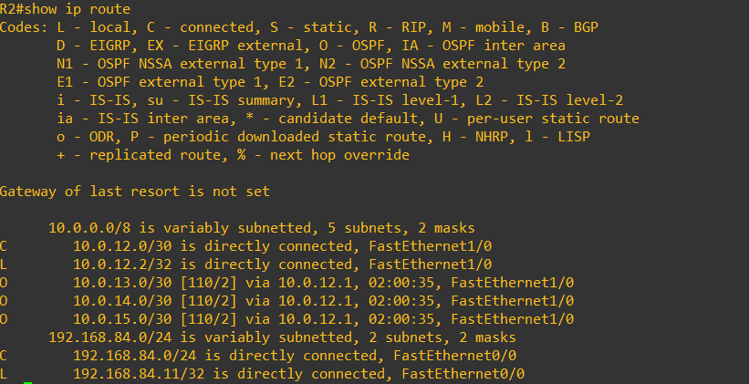
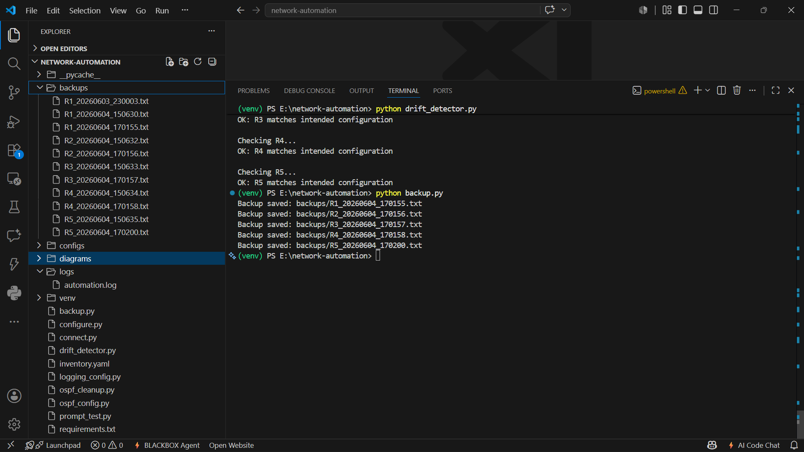
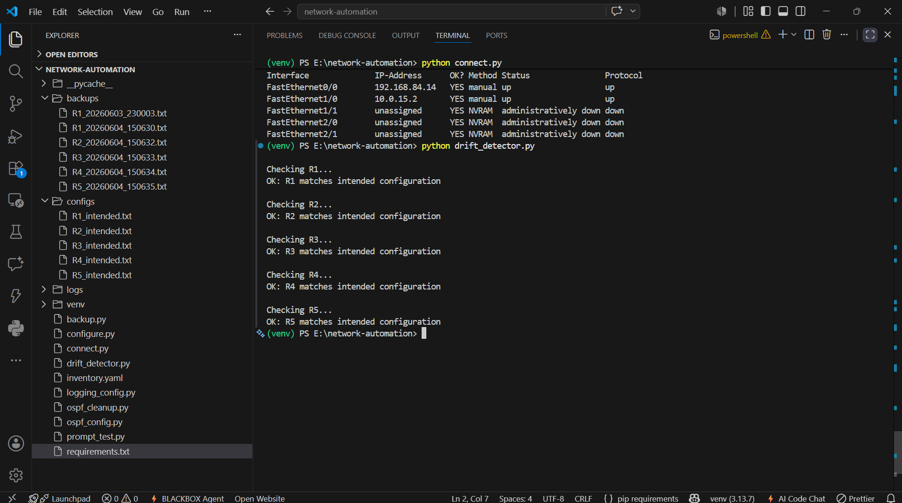

# Network Automation Platform Using Python, Netmiko, GNS3 and Cisco IOS

## Project Overview

This project demonstrates a complete network automation platform built using Python, Netmiko, GNS3, VMware Workstation, and Cisco IOS routers.

The platform automates:

- Multi-router SSH management
- Configuration deployment
- Configuration backup
- Configuration drift detection
- OSPF deployment
- Configuration compliance validation
- Logging and exception handling
- Scheduled backups

The environment simulates an enterprise network consisting of five Cisco routers managed through a centralized automation framework.

---

# Technologies Used

| Technology | Purpose |
|------------|----------|
| Python | Automation |
| Netmiko | SSH device management |
| YAML | Device inventory |
| GNS3 | Network simulation |
| Cisco IOS | Router operating system |
| VMware Workstation | GNS3 VM hosting |
| OSPF | Dynamic routing |
| Windows Task Scheduler | Automated backups |
| Logging Module | Operational logging |

---

# Features

## Network Automation

- SSH connectivity to multiple routers
- Inventory-driven device management
- Centralized automation execution

## Configuration Management

- Automated configuration deployment
- Configuration backup generation
- Configuration compliance validation

## Routing Automation

- Automated OSPF deployment
- OSPF neighbor validation
- Route verification

## Security

- SSH-only remote access
- Local user authentication

## Monitoring

- Configuration drift detection
- Logging and audit trail generation

## Reliability

- Exception handling
- Device failure tolerance

---

# Project Architecture

## Management Network

```text
                         Windows Host
                               |
                               |
                           VMnet1
                               |
                               |
                            Cloud
                               |
                               |
                       Ethernet Switch
                               |
-----------------------------------------------------
|              |              |             |        |
|              |              |             |        |
R1            R2             R3            R4       R5
192.168.84.10 192.168.84.11 192.168.84.12 192.168.84.13 192.168.84.14
```

---

## Routing Topology

```text
                        R2
                  10.0.12.2
                           |
                           |
                     10.0.12.0/30
                           |
                           |
R3 10.0.13.2 ------ R1 ------ 10.0.14.2 R4
                           |
                           |
                     10.0.15.0/30
                           |
                           |
                        R5
                    10.0.15.2
```

---

## Router Interface Plan

### R1

| Interface | IP Address |
|------------|------------|
| Fa0/0 | 192.168.84.10 |
| Fa1/0 | 10.0.12.1 |
| Fa1/1 | 10.0.13.1 |
| Fa2/0 | 10.0.14.1 |
| Fa2/1 | 10.0.15.1 |

### R2

| Interface | IP Address |
|------------|------------|
| Fa0/0 | 192.168.84.11 |
| Fa1/0 | 10.0.12.2 |

### R3

| Interface | IP Address |
|------------|------------|
| Fa0/0 | 192.168.84.12 |
| Fa1/0 | 10.0.13.2 |

### R4

| Interface | IP Address |
|------------|------------|
| Fa0/0 | 192.168.84.13 |
| Fa1/0 | 10.0.14.2 |

### R5

| Interface | IP Address |
|------------|------------|
| Fa0/0 | 192.168.84.14 |
| Fa1/0 | 10.0.15.2 |

---

# Project Structure

```text
network-automation/
│
├── backups/
│
├── configs/
│   ├── R1_intended.txt
│   ├── R2_intended.txt
│   ├── R3_intended.txt
│   ├── R4_intended.txt
│   └── R5_intended.txt
│
├── logs/
│   └── automation.log
│
├── diagrams/
│   ├── management_topology.png
│   └── routing_topology.png
│
├── screenshots/
│   ├── backup_output.png
│   ├── drift_detection.png
│   ├── ospf_neighbors.png
│   └── connectivity.png
│
├── connect.py
├── configure.py
├── backup.py
├── drift_detector.py
├── ospf_config.py
├── ospf_cleanup.py
├── logging_config.py
│
├── inventory.yaml
├── requirements.txt
└── README.md
```

---

# Installation

## Clone Repository

```bash
git clone https://github.com/yourusername/network-automation.git

cd network-automation
```

---

## Create Virtual Environment

```bash
python -m venv venv
```

---

## Activate Virtual Environment

### Windows

```powershell
venv\Scripts\activate
```

### Linux

```bash
source venv/bin/activate
```

---

## Install Dependencies

```bash
pip install -r requirements.txt
```

---

# Inventory Configuration

Example inventory.yaml:

```yaml
devices:

  - name: R1
    host: 192.168.84.10
    username: admin
    password: cisco123
    device_type: cisco_ios

  - name: R2
    host: 192.168.84.11
    username: admin
    password: cisco123
    device_type: cisco_ios

  - name: R3
    host: 192.168.84.12
    username: admin
    password: cisco123
    device_type: cisco_ios

  - name: R4
    host: 192.168.84.13
    username: admin
    password: cisco123
    device_type: cisco_ios

  - name: R5
    host: 192.168.84.14
    username: admin
    password: cisco123
    device_type: cisco_ios
```

---

# Usage

## Verify Device Connectivity

```bash
python connect.py
```

---

## Push Configuration

```bash
python configure.py
```

---

## Deploy OSPF

```bash
python ospf_config.py
```

---

## OSPF Cleanup

```bash
python ospf_cleanup.py
```

---

## Create Backups

```bash
python backup.py
```

---

## Detect Configuration Drift

```bash
python drift_detector.py
```

---

# Verification Results

## OSPF Neighbors

```text
R1# show ip ospf neighbor

Neighbor ID     State

R2             FULL
R3             FULL
R4             FULL
R5             FULL
```

---

## OSPF Routes

```text
R2# show ip route ospf

O 10.0.13.0/30
O 10.0.14.0/30
O 10.0.15.0/30
```

---

## End-to-End Connectivity

```text
R2# ping 10.0.15.2

!!!!!
Success Rate 100%
```

---

## Drift Detection

```text
Checking R1...
OK: R1 matches intended configuration

Checking R2...
OK: R2 matches intended configuration

Checking R3...
OK: R3 matches intended configuration

Checking R4...
OK: R4 matches intended configuration

Checking R5...
OK: R5 matches intended configuration
```

---

# Logging

Example log output:

```text
2026-06-04 15:30:01 | INFO | Connecting to R1

2026-06-04 15:30:03 | INFO | Backup successful

2026-06-04 15:30:05 | INFO | Drift check completed
```

---

# Screenshots


```text

# Screenshots

## 1. OSPF Routing Topology

This topology contains five Cisco routers connected through OSPF routing links.



---

## 2. Management Network Architecture

This diagram illustrates how the Python automation platform manages all routers through the management network.

<a href="diagrams/management_network_architecture.png">
  
</a>

[View Full Size](diagrams/management_network_architecture.png)

---

## 3. OSPF Neighbor Verification

OSPF adjacency formation between routers after automated deployment.

<a href="screenshots/ospf_neighbors.png">
  
</a>

[View Full Size](screenshots/ospf_neighbors.png)

---

## 4. OSPF Route Learning

Verification of dynamically learned OSPF routes.

<a href="screenshots/ospf_routes.png">
  
</a>

[View Full Size](screenshots/ospf_routes.png)

---

## 5. Automated Backup Generation

Successful backup creation for all routers.

<a href="screenshots/backup_output.png">
  
</a>

[View Full Size](screenshots/backup_output.png)

---

## 6. Configuration Drift Detection

Configuration compliance validation against intended configurations.

<a href="screenshots/drift_detection.png">
  
</a>

[View Full Size](screenshots/drift_detection.png)


```


---

# Future Enhancements

- Jinja2 Configuration Templates
- Flask Web Dashboard
- Email Alerting
- Compliance Reporting
- CI/CD Integration
- REST API Integration
- Ansible Migration
- Multi-Site Network Automation

---

# Skills Demonstrated

- Network Automation
- Python Programming
- Netmiko
- SSH Automation
- Cisco IOS
- OSPF Routing
- Configuration Management
- Drift Detection
- Backup Automation
- Logging
- Exception Handling
- GNS3
- VMware Workstation
- Network Engineering

---

# Author

Surya

Network Automation Project – Built using Python, Netmiko, GNS3, VMware Workstation, and Cisco IOS.
